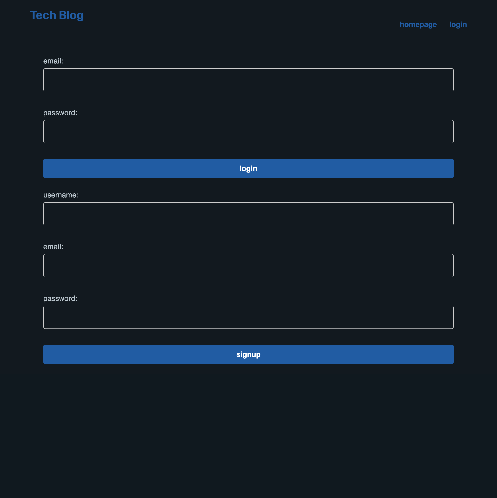

# techblog

## Purpose

A site in which a user can sign up, log in and out, review posts of tech blogs, or post their own content, with comment funtionality built in 

## Built with

HTML, CSS, PicoCss, JavaScript, NodeJS, NPM (Express, Express-Session, connect-session-sequelize, MYSQL, MYSQL2, dotenv, sequelize)

## Usage

Deployed with Heroku! 
Weblink: https://peaceful-cliffs-43767.herokuapp.com/
Github:https://github.com/GelP1987/techblog
Screencapture:

## Contribution

Made with ❤️ by Philip Gelin
